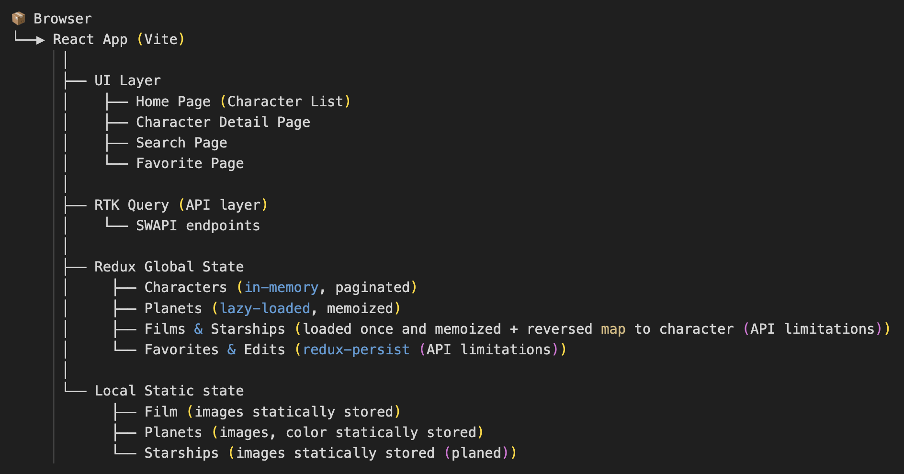

# 🏗️ SWAPI App – Architecture Overview

## 📌 Objective

Build a performant, testable, production-ready React application to explore characters from the Star Wars universe with advanced UX, caching, and offline-ready capabilities — all aligned with Allica Bank’s expectations.

---

## ⚙️ High-Level Architecture



<!-- ```scss

   📦 Browser
   └──▶ React App (Vite)
         │
         ├── UI Layer
         │    ├── Home Page (Character List)
         │    ├── Character Detail Page
         │    ├── Search Page
         │    └── Favorite Page
         │
         ├── RTK Query (API layer)
         │    └── SWAPI endpoints
         │
         ├── Redux Global State
         │     ├── Characters (in-memory, paginated)
         │     ├── Planets (lazy-loaded, memoized)
         │     ├── Films & Starships (loaded once and memoized + reversed map to character (API limitations))
         │     └── Favorites & Edits (redux-persist (API limitations))
         │
         └── Local Static state
               ├── Film (images statically stored)
               ├── Planets (images, color statically stored)
               └── Starships (images statically stored (planed))

``` -->
--- 

## 🧠 Architectural Decisions

### 1. **Framework & Tooling**

| Technology               | Purpose / Justification                              |
|--------------------------|------------------------------------------------------|
| **React + TypeScript**   | Component-based UI with type safety                  |
| **Vite**                 | Lightning-fast build and dev server                  |
| **TailwindCSS**          | Utility-first styling for consistent UI              |
| **Redux Toolkit (RTK)**  | Simplified state management                          |
| **RTK Query**            | Built-in API layer with caching & invalidation       |
| **redux-persist**        | Offline-ready local storage for favorites, edits     |
| **react-window**         | Virtualized infinite scroll for performance          |
| **Jest + Cypress**       | Complete unit + E2E testing strategy                 |

These tools were chosen to **balance performance, developer productivity, and scalability** while keeping the app aligned with **real-world production readiness**.

--- 

## 📦 Data Fetching Strategy

The app relies on SWAPI endpoints and handles data via a combination of **RTK Query** and **custom Redux slices**, ensuring minimal API calls, derived data rendering, and efficient caching.

| Feature             | Endpoint(s)                            | Strategy                              | Caching Layer            |
|---------------------|-----------------------------------------|----------------------------------------|---------------------------|
| **Character List**  | `/people?page=n`                        | Paginated fetch via RTK Query          | In-Memory (Redux)         |
| **Character Detail**| `/people/:id`, local slice state        | Hydrated from character list + Redux   | Derived in local store    |
| **Planet Info**     | `/planets/:id`                          | On-demand via custom fetch             | Redux + redux-persist     |
| **Film & Starship** | `/films`, `/starships`                 | One-time fetch on app init             | Redux + redux-persist     |
| **Search**          | `/people?search=...`                    | Debounced fetch with slice state       | In-Memory (searchSlice)   |
| **Favorites & Edits**| Local only                              | Redux slice + redux-persist            | Persistent (localStorage) |

Data fetching emphasizes:
- **Deduplication** via internal tracking
- **Derived rendering** from existing cache
- **Minimal re-fetching** for known entities

---

## 🧩 Caching Architecture

The app employs a **2-tier caching system** to balance performance and data freshness. It reduces redundant API calls, supports offline usage, and ensures consistency across user sessions.

### Tiered Caching Breakdown

| Tier             | Data Types                                      | Mechanism           | Persistence       |
|------------------|--------------------------------------------------|----------------------|-------------------|
| **In-Memory**    | Character pages, search results, loading states | Redux slices         | Volatile (session)|
| **Persistent**   | Planets, Films, Starships, Favorites, Edits     | `redux-persist`      | LocalStorage       |

### How it Works

- **Character Pages**: Tracked via `characterPageFetchGuard.ts` using `Set<number>`, avoiding duplicate API requests for already-fetched pages.
- **Planet Data**: Fetched on-demand and memoized per character via Redux and persisted cache.
- **Films & Starships**: Loaded once on app initialization and reused for all characters.
- **Favorites & Edits**: Stored locally using `redux-persist` to ensure state survives reloads.

### Benefits

- Fast repeat navigation across detail pages
- Offline-ready user edits/favorites
- Controlled API usage even under large scroll or search interactions

---

## 🧪 Testing Strategy

A layered testing approach ensures the SWAPI app is robust, reliable, and ready for production use.

### ✅ Tools Used

- **Jest**: Unit testing for logic, slices, and components
- **React Testing Library (RTL)**: Component behavior and DOM validation
- **Cypress**: End-to-end (E2E) UI interaction and flow testing
- **ts-jest**: Type-safe testing for TypeScript code

### 🔍 Coverage Strategy

| Layer              | Tool(s)           | Examples Covered                              |
|--------------------|-------------------|-----------------------------------------------|
| **Unit Tests**     | Jest, RTL         | Redux slices, utility functions, hooks        |
| **Component Tests**| RTL               | CharacterCard, PlanetInfo, Toggle, Tooltips   |
| **Integration**    | RTL + Redux store | CharacterDetailPage, search slice interactions|
| **E2E Tests**      | Cypress           | Page routing, search flow, favorite toggle UX |

### 📊 Unit Test Coverage Snapshot

```txt
-----------------------------|---------|----------|---------|---------|-------------------
File                         | % Stmts | % Branch | % Funcs | % Lines | Uncovered Line #s 
-----------------------------|---------|----------|---------|---------|-------------------
All files                    |   92.36 |    82.19 |   85.88 |    92.3 |                   
 components                  |   93.67 |     84.9 |      88 |   93.33 |                   
  card.tsx                   |     100 |       75 |     100 |     100 | 11                
  characterCard.tsx          |     100 |       75 |     100 |     100 | 15-21             
  characterList.tsx          |     100 |    94.44 |   83.33 |     100 | 34                
  favoriteToggle.tsx         |     100 |      100 |     100 |     100 |                   
  genderInfo.tsx             |     100 |      100 |     100 |     100 |                   
  loader.tsx                 |     100 |      100 |     100 |     100 |                   
  toolTip.tsx                |     100 |      100 |     100 |     100 |                   
  updatingForm.tsx           |      80 |       75 |   66.66 |      80 | 29                
  virtualizedGrid.tsx        |   76.47 |    66.66 |      80 |   76.47 | 29-31,56          
 components/planetInfo       |    92.3 |    84.05 |    87.5 |   92.15 |                   
  index.tsx                  |   81.81 |    47.61 |      75 |   80.95 | 21-22,28,35       
  planetCardInfo.tsx         |     100 |      100 |     100 |     100 |                   
  planetDetailInfo.tsx       |     100 |      100 |     100 |     100 |                   
 components/skeletons        |     100 |      100 |     100 |     100 |                   
  characterCardSkeleton.tsx  |     100 |      100 |     100 |     100 |                   
 constants                   |   77.77 |        0 |      50 |   77.77 |                   
  api.constant.ts            |   66.66 |        0 |      50 |   66.66 | 6-7               
  content.constant.ts        |     100 |      100 |     100 |     100 |                   
  planet.constant.ts         |     100 |      100 |     100 |     100 |                   
  state.constant.ts          |     100 |      100 |     100 |     100 |                   
 features/cache              |     100 |      100 |     100 |     100 |                   
  cacheSlice.ts              |     100 |      100 |     100 |     100 |                   
 features/characters         |   88.33 |       70 |   85.71 |   88.07 |                   
  characterApi.ts            |   83.33 |      100 |      50 |   83.33 | 10                
  characterSlice.ts          |   96.49 |    76.92 |     100 |   96.07 | 40,51             
  favoriteSlice.ts           |    92.3 |      100 |   66.66 |    92.3 | 37                
  searchSlice.ts             |   72.22 |       40 |   77.77 |   70.96 | 21-34             
  updatedCharacterSlice.ts   |     100 |      100 |     100 |     100 |                   
 features/planets            |   84.61 |      100 |   33.33 |   85.71 |                   
  planetAPI.ts               |   84.61 |      100 |   33.33 |   85.71 | 12,29-30          
 pages/characterDetailPage   |     100 |      100 |     100 |     100 |                   
  characterDataDisplay.tsx   |     100 |      100 |     100 |     100 |                   
  characterHeader.tsx        |     100 |      100 |     100 |     100 |                   
 services                    |     100 |    85.71 |     100 |     100 |                   
  networkAPI.ts              |     100 |    85.71 |     100 |     100 | 10                
 store                       |     100 |      100 |     100 |     100 |                   
  hooks.ts                   |     100 |      100 |     100 |     100 |                   
  store.ts                   |     100 |      100 |     100 |     100 |                   
 utils                       |     100 |      100 |     100 |     100 |                   
  characterPageFetchGuard.ts |     100 |      100 |     100 |     100 |                   
 utils/test                  |     100 |      100 |     100 |     100 |                   
  makeTestStore.ts           |     100 |      100 |     100 |     100 |                   
  testRootReducer.ts         |     100 |      100 |     100 |     100 |                   
-----------------------------|---------|----------|---------|---------|-------------------

Test Suites: 20 passed, 20 total
Tests:       84 passed, 84 total
Snapshots:   0 total
Time:        5.748 s
Ran all test suites.
✨  Done in 7.99s.
```

> You can replace the image path with your actual coverage report screenshot.

### 📈 Goals Achieved

- High-confidence code changes
- Edge case validation
- CI/CD ready test structure

---

## 📁 File & Folder Structure (High-Level)

The project follows a **feature-based modular structure** to maximize scalability, clarity, and separation of concerns.

```txt
        src/
        │
        ├── components/ # Reusable UI components (cards, tooltips, loaders)
        │
        ├── constants/ # Static configuration: API endpoints, labels, mappings
        │
        ├── features/ # Redux slices + domain logic (characters, planets, etc.)
        │       ├── characters/ # characterSlice, characterApi, favorites, search
        │       ├── planets/ # planetApi + planet cache logic
        │       ├── cache/ # Shared RTK state: planet, starship, film, mappings
        │
        ├── hooks/ # Custom hooks (infinite scroll, debounced search)
        │
        ├── pages/ # Route-level screens (CharacterDetailPage, SearchPage)
        │       ├── characterDetailPage/
        │       └── ...
        │
        ├── services/ # Fetch utilities (fetchListFromAPI, fetchDetailFromAPI)
        │
        ├── store/ # Redux store setup, typed hooks
        │
        ├── utils/ # Pure utilities: pagination guards, test utils
        │       ├── test/ # makeTestStore, testRootReducer
        │
        └── types/ # Shared TypeScript types (CHARACTER, PLANET, etc.)
```

> Each feature folder contains only the logic it owns — making future migrations to micro-frontends or modules trivial.

---

## 🧳 Dev & Build Notes

| Area               | Approach                                                                 |
|--------------------|--------------------------------------------------------------------------|
| **Pagination**     | Infinite scroll using `react-window`'s `FixedSizeGrid` with `onItemsRendered` |
| **Search**         | Debounced input → character search using `?name=` param and RTK query   |
| **Accessibility**  | Semantic HTML tags, ARIA roles, keyboard-accessible toggles and labels  |
| **Performance**    | `React.memo`, memoized selectors, windowing for lists, low re-render churn |
| **Persistence**    | Favorites and inline edits stored via `redux-persist` in localStorage   |
| **Fallback UX**    | Skeleton loaders and error states across async UI                      |
| **Code Standards** | ESLint, Prettier, `ts-prune`, `eslint-plugin-unused-imports`            |
| **Testing**        | Unit: Jest + RTL | E2E: Cypress | Coverage >90%                         |
| **Build Tool**     | Vite + TypeScript                                                       |

--- 

## 📤 Submission Structure

| Item                             | Included |
|----------------------------------|----------|
| ✅ Source Code                   | Yes      |
| ✅ README with setup/use         | Yes      |
| ✅ `docs/architecture.md`        | Yes      |
| ✅ `SUBMISSION_CHECKLIST`        | Yes      |
| ✅ Test Coverage Report          | Yes      |
| ✅ Screenshots / GIFs            | Yes (if time permits) |

The project is organized and submitted in a self-contained manner, ready to be reviewed or deployed.

---

## ✅ Summary

This architecture supports:

- 🚀 **High performance** for rendering large lists using virtualization.
- 🔁 **Minimal API calls** with RTK Query and custom caching strategies.
- 💾 **Offline-readiness** using redux-persist for critical state (favorites, edits, planet/film/starship data).
- ♻️ **Scalable code structure** using feature-based folders and typed slices.
- 🧱 **Modularity** that can evolve into micro frontends (MFE) if required.
- 🧪 **Robust testing** via Jest (unit/integration) and Cypress (E2E).
- 🎯 **Clean UX** with responsive design, inline editing, tooltips, loading skeletons, and accessibility in mind.

> Designed to align with Allica Bank’s standards: maintainable, scalable, and production-grade.

---

## 👨‍💻 Author & Maintainer

**Pritam Kininge** — Frontend Developer | React, TypeScript, TDD  
📍 Navi Mumbai, India (UTC+5:30)  
🗓️ Submitted: June 25, 2025  
[LinkedIn](https://linkedin.com/in/pritam-kininge)  |  [GitHub](https://github.com/kininge)  |  [Leetcode](https://leetcode.com/u/kininge007/)


